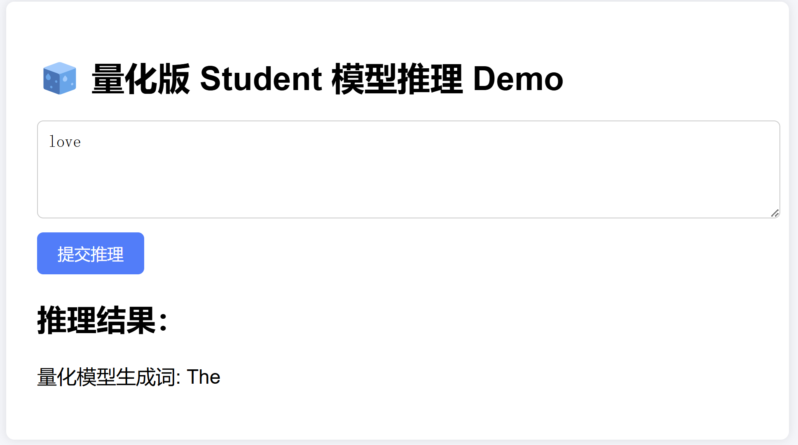

# ✅ GPT-2 模型训练优化与部署全流程项目（Project 8 汇总版）

> 作者：Yoan ｜ [Yoan AI Lab 技术导航页](https://docs.qq.com/doc/DV3RtTG90cXBHa01T)  
> 项目亮点：模型训练优化 + 多种部署方式 + 七大子项目独立封装  
> 项目地址合集：请见下方每个子项目链接

---

## 📌 项目背景简介

本项目聚焦 GPT-2 模型的微调、推理优化与多种部署实践，旨在打造一个完整的 AI 工程闭环。  
通过从模型训练到部署、推理加速、压缩优化等七大维度出发，系统构建了可复现的 AI 服务端到端方案。

---

## 📂 项目子目录结构

```plaintext
PythonProject_GPT2/
├── python1_basic_training/        # 📘 模型训练与部署基础版（Project 1）
├── python2_onnx_tensorrt_infer/   # ⚡ ONNX + TensorRT 加速部署（Project 2）
├── python3_distillation/          # 🔬 模型蒸馏与对比优化（Project 3）
├── python4_pruning/               # ✂️ 模型剪枝轻量化部署（Project 4）
├── python5_quantization/          # 🧊 模型 INT8 动态量化部署（Project 5）
├── python6_k8s_deploy/            # ☁️ Kubernetes 自动扩缩容部署（Project 6）
├── python7_dist_infer_demo/       # 🧠 分布式推理多进程优化（Project 7）
└── README.md                      # ✅ 项目汇总说明（Project 8）
```

---

## 🔗 子项目汇总与功能概览

| 子项目 | 项目链接 | 功能亮点 |
|--------|----------|-----------|
| Project 1：基础训练部署 | [gpt2-train-deploy-demo](https://github.com/YoanAILab/gpt2-train-deploy-demo) | GPT-2 微调训练 + Flask API + 网页 UI 展示 |
| Project 2：TensorRT 推理优化 | [gpt2-trt-deploy](https://github.com/YoanAILab/gpt2-trt-deploy) | ONNX 导出 + TensorRT 加速推理 + Golang 接口 |
| Project 3：模型蒸馏部署 | [gpt2-distillation-train-infer-deploy](https://github.com/YoanAILab/gpt2-distillation-train-infer-deploy) | Teacher → Student 蒸馏训练 + 精简模型推理 |
| Project 4：剪枝轻量化 | [gpt2-prune-train-deploy](https://github.com/YoanAILab/gpt2-prune-train-deploy) | Linear 层剪枝 + API 封装 + Web 推理展示 |
| Project 5：量化部署 | [gpt2-quantize-infer-deploy](https://github.com/YoanAILab/gpt2-quantize-infer-deploy) | 动态 INT8 量化模型 + 性能对比分析 |
| Project 6：K8s 部署 | [k8s_deploy_quant](https://github.com/YoanAILab/k8s_deploy_quant) | Kubernetes 配置 YAML + 自动扩缩容模拟 |
| Project 7：分布式推理 | [dist_infer_demo](https://github.com/YoanAILab/dist_infer_demo) | 多进程 torchrun 分布式推理 + GPU/CPU 混合策略 |

---

## 🧱 核心技术栈

| 模块         | 工具与框架                   |
|--------------|------------------------------|
| 模型训练     | PyTorch + HuggingFace Transformers |
| 推理优化     | ONNX、TensorRT、INT8 动态量化、剪枝 |
| 模型压缩     | 蒸馏（Distillation）、剪枝（Pruning）、量化（Quantization） |
| 后端服务     | Flask + Python API、Golang 调用 |
| 容器部署     | Docker、Kubernetes（K8s YAML） |
| 多进程推理   | torchrun + PyTorch Distributed |
| 网页展示     | HTML + CSS + JS（手动构建前端） |

---

## 🧪 演示截图预览

> 更多截图见子项目 sample_images/ 目录

<p align="center">
  
</p>

---

## 📌 项目运行方式简要

每个子项目均包含 `Dockerfile_xx_backend` 和 `README_pythonX_xx.md`，支持：

- 本地 Python 运行：`python app.py`
- Docker 运行：`docker build + docker run`
- 分布式推理：`bash launch.sh`
- K8s 部署：`kubectl apply -f k8s/`

---

## ✨ 后续扩展方向（计划中）

- 多卡模型并行（Tensor Parallel）
- KV Cache 优化推理
- 基于 LLM 的低延迟 Serving 框架（如 SGLang、vLLM）
- AIGC 模型快速部署样例（文本 → 图像）

---

## 📜 License

本项目遵循 MIT 协议，欢迎 Fork & Star。
