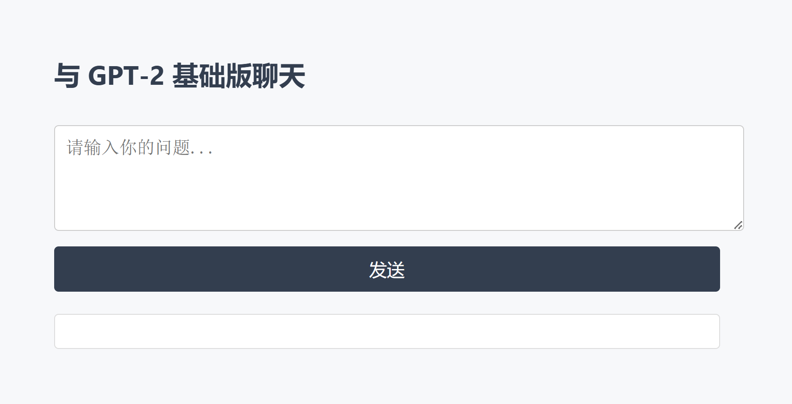
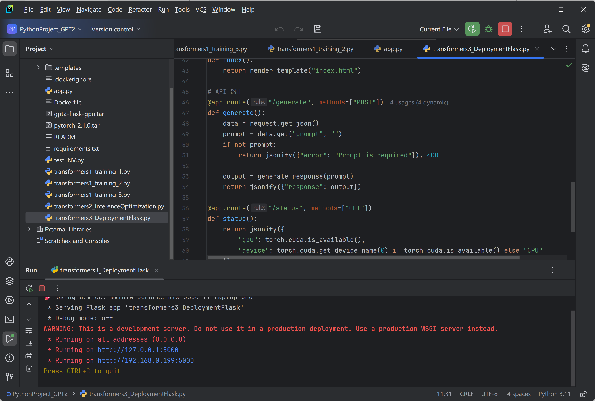

# GPT-2 大语言模型训练与部署全流程项目（本地 + Flask + Docker）

本项目展示了一个完整的 GPT-2 微调 + 推理优化 + Flask 部署 + Docker 打包 + 网页交互 的闭环流程，适合用于 AI Infra / 模型训练工程岗求职展示与学习使用。

---

## 🚀 项目功能亮点

- ✅ 使用 PyTorch + Transformers 微调 GPT-2（Wikitext-2 数据集）
- ✅ 支持 FP16、gradient checkpointing 降显存
- ✅ 推理部署基于 Flask API 服务，支持文本对话生成
- ✅ Docker 容器封装，快速本地部署 + 支持 Ngrok 公网访问
- ✅ 提供简洁 HTML+CSS 网页界面，可直接输入对话交互

---

## 🧱 项目结构说明
```
python1_basic_training/
├── app.py					# Flask 主服务程序（入口）
├── gpt2_finetune/                  # 模型保存路径（只保留结构，不上传权重）
│   ├── config.json
│   ├── tokenizer_config.json
│   ├── model.safetensors	# 权重文件，文件过大未上传，需自己执行 transformers1_training_3.py 生成
│   └── ...
├── templates/
│   └── index.html                  # Web 聊天输入界面（HTML 页面）
├── static/
│   └── style.css                   # Web 样式文件
├── transformers1_training_1.py     # GPT-2 训练脚本 v1（基础训练）
├── transformers1_training_2.py     # GPT-2 训练脚本 v2（优化训练）
├── transformers1_training_3.py     # GPT-2 训练脚本 v3（多轮实验）
├── transformers2_InferenceOptimization.py  # 推理优化配置
└── transformers3_DeploymentFlask.py        # 部署服务整合（和 app.py 一样，app.py是为了在docker中运行）
```
---

## 🖼️ 效果截图

网页对话界面展示👇



---

## 🔧 技术栈

- PyTorch / Transformers (HuggingFace)
- Flask + HTML + CSS
- Docker + Ngrok
- Shell / Git / Python 基础工具

---

## 🧪 快速启动

```bash
# 安装依赖
pip install -r requirements_v1_backend.txt

# 启动 Flask 接口服务
python python1_basic_training/app.py

# 浏览器访问 http://localhost:5000

# 构建镜像
docker build -f Dockerfile_v1_backend -t gpt2-flask .

# 运行容器（暴露端口）
docker run -p 5000:5000 gpt2-flask

ngrok http 5000
# 访问分配的网址，即可远程体验 Web 对话

```

---

## 常用命令
镜像启动方式：
先打开PC的 docker desktop APP
docker run --gpus all -p 5000:5000 gpt2-flask-gpu
再开个终端运行下面的
ngrok http 5000

docker 常用命令：
docker image ls
docker image rm xxxxxx
docker ps -a
docker stop  gpt2-flask-gpu
docker container rm -f xxxxxxx

构建和运行镜像：
在项目根目录下构建镜像执行：docker build -t gpt2-flask-gpu .
启动带 GPU 的容器：docker run --gpus all -p 5000:5000 gpt2-flask-gpu

构建镜像时由于网络原因容易出错就先下载下来一些基础镜像：
下载：docker pull pytorch/pytorch:2.1.0-cuda11.8-cudnn8-runtime
导出：docker save -o pytorch-2.1.0.tar pytorch/pytorch:2.1.0-cuda11.8-cudnn8-runtime
导入：docker load -i pytorch-2.1.0.tar


