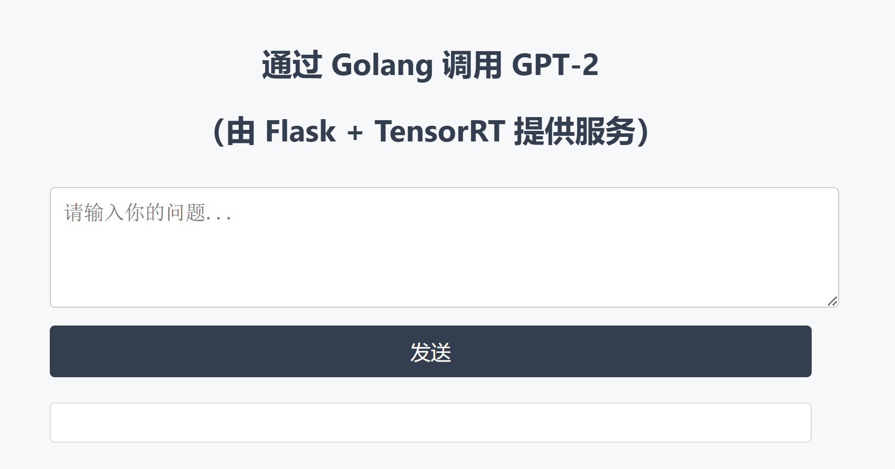

# GPT-2 微调、推理加速与服务化部署项目（PyTorch → ONNX → TensorRT + Flask + Go）

本项目展示了一个完整的大语言模型从微调训练、推理优化、API 服务、跨语言调用，到容器部署的工程闭环流程，适用于 AI Infra / 推理优化 / 模型部署方向的学习参考与求职作品集展示。

---

## 🚀 项目核心亮点

- ✅ 微调训练：使用 HuggingFace Transformers + Wikitext-2 完成 GPT-2 微调
- ✅ 推理加速：PyTorch 导出 ONNX，使用 TensorRT 构建高性能推理引擎
- ✅ 一致性验证：PyTorch 与 TensorRT 推理输出对比验证，确保精度一致
- ✅ 后端部署：Flask 封装推理服务，GPU常驻推理，支持高并发调用
- ✅ 前端接入：Golang 构建前端服务，通过 HTTP 请求访问推理接口
- ✅ 容器化部署：Docker 镜像分版管理（基础版 / TensorRT版）
- ✅ 可视化展示：基于HTML + CSS提供网页输入界面，支持浏览器对话

---

## 📁 项目结构概览

```
PythonProject_GPT2/
├── python1_basic_training/           # 第一版：GPT-2 微调训练 + 原生推理 + Flask部署
│   ├── gpt2_finetune/              # 微调后保存的 GPT-2 模型权重
│   ├── app.py
│   ├── transformers1_training_1.py
│   ├── transformers1_training_2.py
│   ├── transformers1_training_3.py
│   ├── transformers2_InferenceOptimization.py
│   ├── transformers3_DeploymentFlask.py
│   ├── static/
│   └── templates/

├── python2_onnx_tensorrt_infer/    # 第二版：ONNX导出 + TensorRT推理 + Flask后端
│   ├── model/                      # 导出的 GPT-2 ONNX 模型
│   ├── go_api/                    # Go语言前端服务（访问 Flask 后端推理API）
│   ├── app.py
│   ├── export_to_onnx.py
│   ├── infer_utils.py
│   ├── trt_infer.py
│   └── infer_api_server.py

├── Dockerfile_v1_backend       # 第一版基础版（原生PyTorch + Flask）
├── Dockerfile_v2_backend       # 第二版后端（TensorRT推理服务）
├── Dockerfile_v2_frontend      # 第二版前端（Go网页服务）
├── requirements_v1_backend.txt # 第一版Python依赖
├── requirements_v2_backend.txt # 第二版Python依赖
├── .dockerignore               # Docker构建忽略文件
├── .gitignore                  # Git提交忽略文件
└── README_python2_onnx_tensorrt_infer.md
```

---

## 🔧 技术栈

- **训练与优化**：PyTorch、HuggingFace Transformers、ONNX、Mixed Precision
- **推理加速**：TensorRT、PyCUDA、CUDA
- **后端开发**：Flask (Python)、Gin (Go)
- **容器化部署**：Docker、NVIDIA GPU 加速
- **前端展示**：HTML、CSS、Postman 接口测试

---

## 📊 PyTorch vs TensorRT 推理性能对比

> 测试自 `infer_utils.py`：

| 推理引擎 | 单次推理耗时 | Top-1 token输出 | 输出一致性 |
|:--------:|:------------:|:---------------:|:----------:|
| PyTorch  | 178.90 ms    | 11               | ✅ 是       |
| TensorRT | **5.01 ms**  | 11               | ✅ 是       |

📈 加速比例约 **35倍**，且输出完全一致！

---

## 🧪 快速启动方式

### 1. 启动后端推理服务（TensorRT版）

构建镜像：

```bash
docker build -f Dockerfile_v2_backend -t gpt2-v2-backend .
```

运行容器：

```bash
docker run -d -p 6006:6006 gpt2-v2-backend
```

POST访问示例：

```bash
POST http://localhost:6006/infer
{
  "prompt": "Hello world"
}
```

---

### 2. 启动前端网页服务（Go版）

构建镜像：

```bash
docker build -f Dockerfile_v2_frontend -t gpt2-v2-frontend .
```

运行容器：

```bash
docker run -d -p 8080:8080 gpt2-v2-frontend
```

浏览器访问：

```
http://localhost:8080
```

---

### 3. （可选）第一版基础版快速启动（PyTorch+Flask）

构建镜像：

```bash
docker build -f Dockerfile_v1_backend -t gpt2-v1-backend .
```

运行容器：

```bash
docker run -d -p 5000:5000 gpt2-v1-backend
```

浏览器访问：

```
http://localhost:5000
```

---

## 🖼️ 效果截图

> Web UI 输入 → Go 前端转发 → Flask后端推理 → JSON响应



---

## ✨ 适用场景推荐

- AI推理服务工程实践
- 模型部署方向求职作品集
- 多语言服务开发（Go+Python混合系统）
- 推理加速优化与边缘部署体验
