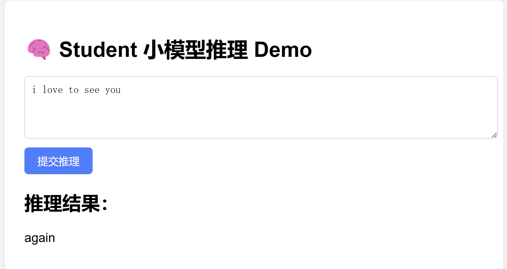

# GPT-2 蒸馏版小模型训练与部署 (v3)

本项目基于 GPT-2 微调后的 Teacher 模型，  
训练出一个自定义小型 Student 模型（减少 Transformer 层数），  
并支持推理服务部署（Flask + 网页界面 + Docker 打包）。

✅ 本项目特点：
- 自定义小型 GPT-2 Student（6层 Transformer）
- 完整 Teacher ➔ Student 蒸馏训练流程
- 支持单条/批量推理
- 支持网页交互（输入 prompt，返回预测）
- 支持轻量化 Docker 部署（GPU环境）

---

## 📂 目录结构

```plaintext
PythonProject_GPT2/
├── python1_basic_training/        # ✅ 保留旧版基础训练实验，未在本项目中使用
├── python2_onnx_tensorrt_infer/    # ✅ 保留旧版ONNX+TensorRT加速实验，未在本项目中使用
├── python3_distillation/           # ⭐ 本项目核心目录（小模型蒸馏版）
│    ├── static/                    # 网页CSS资源
│    ├── templates/                 # 网页HTML模板
│    ├── distill_training.py        # gpt2 ➔ gpt2 蒸馏训练
│    ├── distill_training_v2.py     # gpt2 ➔ 小gpt2（6层）蒸馏训练
│    ├── distill_infer.py            # gpt2_student 推理
│    ├── distill_infer_v2.py         # gpt2_student_v2 小模型推理
│    ├── distill_api_server.py       # gpt2_student 推理API服务
│    ├── distill_api_server_v2.py    # gpt2_student_v2 小模型推理API服务
│    ├── gpt2_student/               # 蒸馏得到的原生 student 模型
│    ├── gpt2_student_v2/            # 蒸馏得到的小型 student_v2 模型
├── Dockerfile_v3.1_backend          # 原版 student 镜像构建文件
├── Dockerfile_v3.2_backend          # 小型 student_v2 镜像构建文件
├── requirements_v3_backend.txt      # 后端依赖包列表
├── README_python3_distillation.md   # 📄 本文件
└── ...
```

> 📌 说明：  
> `python1_basic_training/`、`python2_onnx_tensorrt_infer/`
> 这些目录仅为**保留旧版项目记录，未在本蒸馏小模型项目中实际使用**。

---

## 🧩 版本演进说明

本项目包含两个阶段的蒸馏模型：

| 版本 | Student模型结构 | 参数规模 | 效果 | 改进点 |
|:---|:---|:---|:---|:---|
| v1 | 原版 GPT-2-small（12层 Transformer） | 与 Teacher 接近 | 蒸馏后 loss 明显下降，推理输出合理，但模型体积较大 | 打通蒸馏训练-推理-部署完整流程 |
| v2 | 自定义小型 GPT-2（6层 Transformer） | 参数量减少约50% | 蒸馏后推理速度更快，但预测质量有所下降（因模型小、训练数据少） | 成功实现小型化 Student，推理部署更轻量 |

---

✅ v1阶段：
- 完整复现了 Teacher ➔ Student 蒸馏基础流程
- Student 与 Teacher 结构大小接近
- 重点验证技术闭环（训练、推理、API部署）

✅ v2阶段：
- 自定义小模型（6层 Transformer）
- 模型体积减小，推理速度提升
- 成功打通小模型蒸馏训练、推理、网页部署全流程

📌 当前 Docker 部署版本为 **v2版（小模型 student_v2）**，即运行 `distill_api_server_v2.py`。

---

## 🚀 小模型蒸馏训练流程概览

1. 使用微调后的 GPT-2 作为 Teacher
2. 定义小型 Student（减少 Transformer 层数）
3. Teacher 生成 soft target，Student 通过 KL 散度学习
4. 保存 Student 模型，供推理服务调用
5. 封装推理接口，支持网页调用或API访问

---

## 🛠️ Docker 构建与运行指南

本项目提供两版 Docker 部署：

| 版本 | 镜像文件 | 运行的API服务 | 说明 |
|:---|:---|:---|:---|
| v1 | Dockerfile_v3.1_backend | distill_api_server.py | 原版 Student（gpt2_student）推理 |
| v2 | Dockerfile_v3.2_backend | distill_api_server_v2.py | 小模型 Student（gpt2_student_v2）推理 |

---

### 📦 v1版（原版 Student，gpt2_student）

#### 1. 构建 Docker 镜像

```bash
# 进入项目根目录
cd PythonProject_GPT2/

# 使用 Dockerfile_v3.1_backend 构建 v1版镜像
docker build -f Dockerfile_v3.1_backend -t gpt2-distill-backend-v1 .
```

#### 2. 运行 Docker 容器

```bash
docker run -it --rm -p 6006:6006 gpt2-distill-backend-v1
```

#### 3. 访问推理网页

浏览器访问：

```plaintext
http://localhost:6006/
```

输入 prompt，返回原版 student（gpt2_student）的预测结果！

---

### 📦 v2版（小模型 Student，gpt2_student_v2）

#### 1. 构建 Docker 镜像

```bash
# 进入项目根目录
cd PythonProject_GPT2/

# 使用 Dockerfile_v3.2_backend 构建 v2版镜像
docker build -f Dockerfile_v3.2_backend -t gpt2-distill-backend-v2 .
```

#### 2. 运行 Docker 容器

```bash
docker run -it --rm -p 6006:6006 gpt2-distill-backend-v2
```

#### 3. 访问推理网页

浏览器访问：

```plaintext
http://localhost:6006/
```

输入 prompt，返回小模型 student（gpt2_student_v2）的预测结果！

---

📌 **注意事项：**
- v1和v2共用相同端口（6006），因此**同时只能运行一个版本**！
- 镜像名分别是 `gpt2-distill-backend-v1` 和 `gpt2-distill-backend-v2`，避免混淆。

---

## 📸 示例效果截图



---

## 📌 技术栈版本

| 技术 | 版本 |
|:---|:---|
| PyTorch | 2.1.0 |
| CUDA | 11.8 |
| transformers | 4.x 最新版 |
| Flask | 最新版 |
| Python | 3.11 |

---

## ✨ 后续扩展方向

- 【剪枝版】在小 student_v2 模型基础上进行稀疏剪枝，进一步压缩模型
- 【量化版】在小模型基础上进行 int8 量化推理加速
- 【数据增强】扩充训练集，进一步提升小模型推理质量

---
