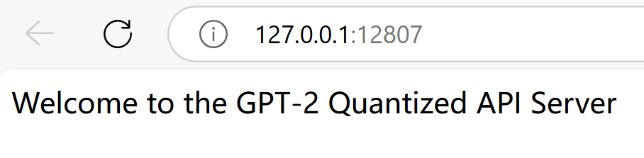

# GPT-2 量化模型 K8s 部署项目（v6）

本项目通过 Kubernetes + Flask 部署 GPT-2 小模型（已量化），结合 Minikube 实现本地服务自动扩缩容和 Web API 推理展示。

✅ 项目亮点：
- 使用 INT8 动态量化压缩小模型
- 支持 Kubernetes 部署、扩缩容、日志调试等完整流程
- 使用 Minikube 本地集群模拟生产部署
- 网页 UI 可演示模型推理效果

<p align="center">
  
</p>

---

## 📂 项目结构说明

```plaintext
PythonProject_GPT2/
├── python6_k8s_deploy/              # ⭐ 本项目核心目录（K8s部署）
│   ├── k8s_quant_api_server.py      # Flask 启动量化服务脚本
│   └── k8s/                         # Kubernetes YAML 文件夹
│       ├── deployment.yaml
│       ├── service.yaml
│       └── hpa.yaml
├── Dockerfile_v6_backend            # 🚀 本项目镜像构建文件
├── requirements_v6_backend.txt      # 📦 本项目依赖文件
├── README_python6_k8s_deploy.md     # 📄 当前文件（部署说明）
├── sample_images/k8s.png            # ✅ 网页截图
```

> 📌 以下目录为项目历史版本，**本版本未使用其中内容**：
> - `python1_basic_training/`
> - `python2_onnx_tensorrt_infer/`
> - `python3_distillation/`
> - `python4_pruning/`
> - `python5_quantization/`

---

## 🧰 环境安装指南（Windows）

### ✅ 1. 安装必要组件

```bash
winget install -e --id Kubernetes.minikube
winget install -e --id Kubernetes.kubectl
```

确保已安装并启动 Docker Desktop。

### ✅ 2. 启动 Minikube

```bash
minikube start --driver=docker
```

### ✅ 3. 切换到 Minikube 的 Docker 环境

```powershell
& minikube docker-env | Invoke-Expression
```

验证是否成功：

```bash
docker images
```

> 恢复默认环境：

```powershell
& minikube docker-env -u | Invoke-Expression
```

---

## 🛠️ 镜像构建与部署流程

### 1. 构建本地镜像

```bash
docker build -f Dockerfile_v6_backend -t gpt2-k8s-backend .
docker images
```

> 或导入外部镜像：

```bash
minikube image load pytorch/pytorch:2.1.0-cuda11.8-cudnn8-runtime
```

---

### 2. 应用 Kubernetes 配置

确保 `deployment.yaml` 中添加：

```yaml
imagePullPolicy: Never   # ❗关键：强制使用本地镜像
```

部署服务：

```bash
kubectl apply -f python6_k8s_deploy/k8s/deployment.yaml
kubectl apply -f python6_k8s_deploy/k8s/service.yaml
kubectl apply -f python6_k8s_deploy/k8s/hpa.yaml
```

---

### 3. 访问服务

```bash
kubectl get pods     # 等待 Running 状态
minikube service gpt2-k8s-service --url
```

复制输出的 URL，用浏览器访问即可。

---

## 🔍 常用调试命令

```bash
kubectl get pods
kubectl logs <pod-name>
kubectl describe pod <pod-name>
```

---

## 🛑 停止或重启服务

### 停止单个服务：

```bash
kubectl delete -f python6_k8s_deploy/k8s/deployment.yaml
kubectl delete -f python6_k8s_deploy/k8s/service.yaml
kubectl delete -f python6_k8s_deploy/k8s/hpa.yaml
```

### 停止整个集群：

```bash
minikube stop
```

### 删除集群（完全重置）：

```bash
minikube delete
```

---

## 📜 License

本项目遵循 MIT License。

---

## 🔮 后续可拓展方向

- 部署 GPU 推理任务（启用 NVIDIA 插件）
- 使用 Ingress 实现负载均衡与统一入口
- 支持云上部署（EKS、ACK、GKE）
